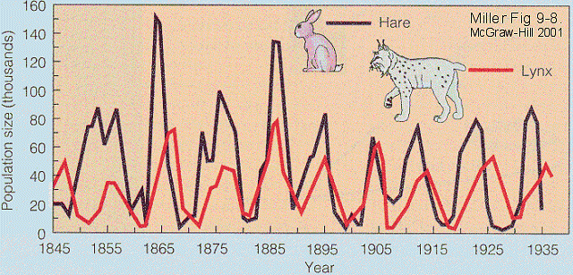

---
redirect_from:
  - "/homework/hw0-2019"
interact_link: content/C:\Nobackup\EL2620\el2620_notes\content\homework/HW0_2019.ipynb
kernel_name: python3
title: 'Homework 0'
prev_page:
  url: /intro
  title: 'Home'
next_page:
  url: /https://github.com/jupyter/jupyter-book
  title: 'GitHub repository'
comment: "***PROGRAMMATICALLY GENERATED, DO NOT EDIT. SEE ORIGINAL FILES IN /content***"
---

# Homework 0 - Population dynamics

Suppose that there is a grassy island supporting populations of two species $x$ and $y$. If the populations are large then it is reasonable to let the normalized populations be continuous functions of time (so that $x=1$ might represent a population of e.g., 1000 specimen). We propose the following simple model of the change in population:
\begin{equation}
\dot x(t) = f_x(x(t),y(t))=x(t)(a+bx(t)+cy(t))\\
\dot y(t) = f_y(x(t),y(t))=y(t)(d+ey(t)+fx(t))\\
\end{equation}
where $x$ and $y$ are non-negative functions and $a$, $b$, . . . , $f$ are constants. Let us start with discussing the model heuristically to gain some insight. 
Consider first a single species with no interaction with the other: $\dot x=x(a+bx)$. If $x$ is a herbivore (plant-eater) species it is reasonable to assume that it can maintain a certain population by itself (there will be enough food). If the initial population is small it will grow, hence $a>0$ , but if the population grows too large there will be more competition for food and more deceases will spread. Hence, $b<0$. This enables non-zero equilibria for the species when they are alone; the populations will not grow unbounded but reach an finite equilibrium. If $x$ is a carnivore (meat-eater) it requires the other (plant-eater) species in order to maintain a population. By itself it will die out, $a<0$. Also here we could argue that large populations increase the internal rivalry and then $b\le0$. Equivalent conditions hold for the parameters $d$ and $e$ if we consider the species $y$. 


{:.input_area}
```python
import numpy as np
import matplotlib.pyplot as plt
from scipy.integrate import odeint
import ipywidgets as widgets
def popdyn(z, t, a, b, c, d, e, f):
    x, y = z
    xdot = x*(a+b*x+c*y)
    ydot = y*(d+e*y+f*x)
    return [xdot, ydot]
a = widgets.FloatSlider(
    value=4,
    min=0,
    max=10.0,
    step=0.1,
    description='a:',
    disabled=False,
    continuous_update=False,
    orientation='horizontal',
    readout=True,
    readout_format='.1f',
)
y0 = [np.pi,np.pi]
t = np.linspace(0,20,1001)
#def popdyn_plot(a):
p = (4, -1, -2, -1, -0.5, 0.5)
y = odeint(popdyn,y0,t,args=p)
plt.plot(t,y)
plt.show()
#widgets.interact(popdyn_plot,a=a)

```


{:.output .output_png}


{:.input_area}
```python
plt.plot(t,y)
plt.show()
```


{:.output .output_png}


